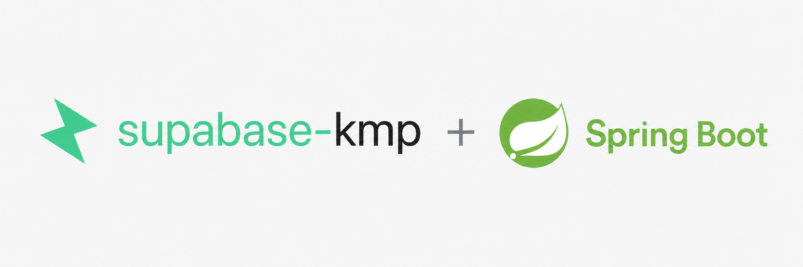

<p align="center">
  
</p>

<h1 align="center">supabase-kmp-spring</h1>

<p align="center">
  <b>Spring Boot · Supabase</b><br/>
  A clean, production-shaped Spring Boot backend whose data layer is
  <a href="https://supabase.com">Supabase</a>, accessed through the
  <a href="https://github.com/AndroidPoet/supabase-kmp">supabase-kmp</a> SDK.
</p>

<p align="center">
  
  
  
  
  
</p>

---

## Why this exists

Most "Spring + Supabase" samples reach for the Postgres JDBC driver and an ORM.
This one talks to Supabase the way a **client app** does — over PostgREST through
the [supabase-kmp](https://github.com/AndroidPoet/supabase-kmp) SDK, with Row
Level Security doing the gatekeeping. supabase-kmp is a Kotlin Multiplatform
library whose JVM target drops straight into a Spring Boot service.

The structure is intentionally production-shaped: a `config / common / <feature>`
layering, plain Spring constructor injection, a clean Controller → Service →
Repository-interface → adapter flow, Problem Details errors, request validation,
and auto-generated OpenAPI — with **supabase-kmp** as the data layer instead of a
Postgres driver and ORM.

## How it's wired

Idiomatic Spring throughout — constructor injection with `@Service` / `@Repository`,
and a small `@Configuration` that exposes the supabase-kmp clients as beans:

```kotlin
@Configuration
class SupabaseConfiguration {
    private val config = AppConfig.fromEnvironment()

    @Bean
    fun supabaseClient(): SupabaseClient =
        Supabase.create(config.supabase.url, config.supabase.anonKey) { logging = config.supabase.logging }

    @Bean
    fun databaseClient(client: SupabaseClient): DatabaseClient = createDatabaseClient(client)
}
```

```kotlin
@Repository
class SupabaseProductRepository(private val database: DatabaseClient) : ProductRepository {
    override suspend fun findAll(): SupabaseResult<List<Product>> =
        database.selectTyped(table = "products") { order("created_at", ascending = false) }
    // create / update / delete …
}
```

supabase-kmp is **coroutine-first**; services bridge its `suspend` /
`SupabaseResult` API to Spring's blocking model with `runBlocking` + `unwrap()`,
which maps each `SupabaseError.category` to the right HTTP status
([`SupabaseResultExtensions.kt`](src/main/kotlin/dev/androidpoet/supabasespring/common/SupabaseResultExtensions.kt)).

## Project layout

```
src/main/kotlin/dev/androidpoet/supabasespring/
├── DemoApplication.kt
├── config/   AppConfig · SupabaseConfiguration   # env config + client beans
├── common/   Exceptions · GlobalExceptionHandler · HealthController
│             OpenApiConfig · SupabaseResultExtensions
├── users/    Models · Repository · SupabaseUserRepository · Service · Controller
└── products/ Models · Repository · SupabaseProductRepository · Service · Controller
```

## Getting started

> **Java 17+** (the supabase-kmp artifacts are compiled for Java 17).

**1. Create the schema** — run [`supabase/migration.sql`](supabase/migration.sql)
in the Supabase SQL editor (creates `users` + `products` with demo anon RLS).

**2. Set credentials** (use the **anon** key, never service-role):

```bash
export SUPABASE_URL="https://YOUR-PROJECT.supabase.co"
export SUPABASE_ANON_KEY="YOUR-ANON-KEY"
```

**3. Run:**

```bash
./gradlew bootRun
```

| | URL |
|---|---|
| Swagger UI | <http://localhost:8080/swagger-ui.html> |
| OpenAPI JSON | <http://localhost:8080/v3/api-docs> |
| Liveness / Readiness | `GET /livez` · `GET /readyz` |

## API

| Method | Path | Body | Result |
|---|---|---|---|
| `POST` | `/api/users` | `{ "email", "displayName" }` | `201` user |
| `GET` | `/api/users/{id}` | — | user |
| `GET` | `/api/products` | — | products |
| `GET` | `/api/products/{id}` | — | product |
| `POST` | `/api/products` | `{ "name", "description?", "price" }` | `201` product |
| `PUT` | `/api/products/{id}` | `{ "name", "description?", "price" }` | product |
| `DELETE` | `/api/products/{id}` | — | `204` |

```bash
curl -s localhost:8080/api/products \
  -H 'Content-Type: application/json' \
  -d '{"name":"Coffee","description":"Dark roast","price":12.5}'
```

Errors come back as RFC 7807 Problem Details — validation failures (`400`),
not-found (`404`), conflicts (`409`), and anything PostgREST reports, mapped from
`SupabaseError.category`.

## Stack & notes

- **Kotlin 2.3** · **Spring Boot 3.5** · **Java 17**
- **supabase-kmp 0.9.1** — `supabase-client`, `supabase-database`
- springdoc-openapi · kotlinx-coroutines / serialization

> Kotlin is pinned to **2.3** because a 2.3 compiler can still read supabase-kmp's
> 2.4.0 metadata (a compiler reads one minor version of metadata ahead); building
> with an older Kotlin fails with *"incompatible version of Kotlin"*.

## Credits

Data layer powered by [supabase-kmp](https://github.com/AndroidPoet/supabase-kmp).

## License

[MIT](LICENSE)
